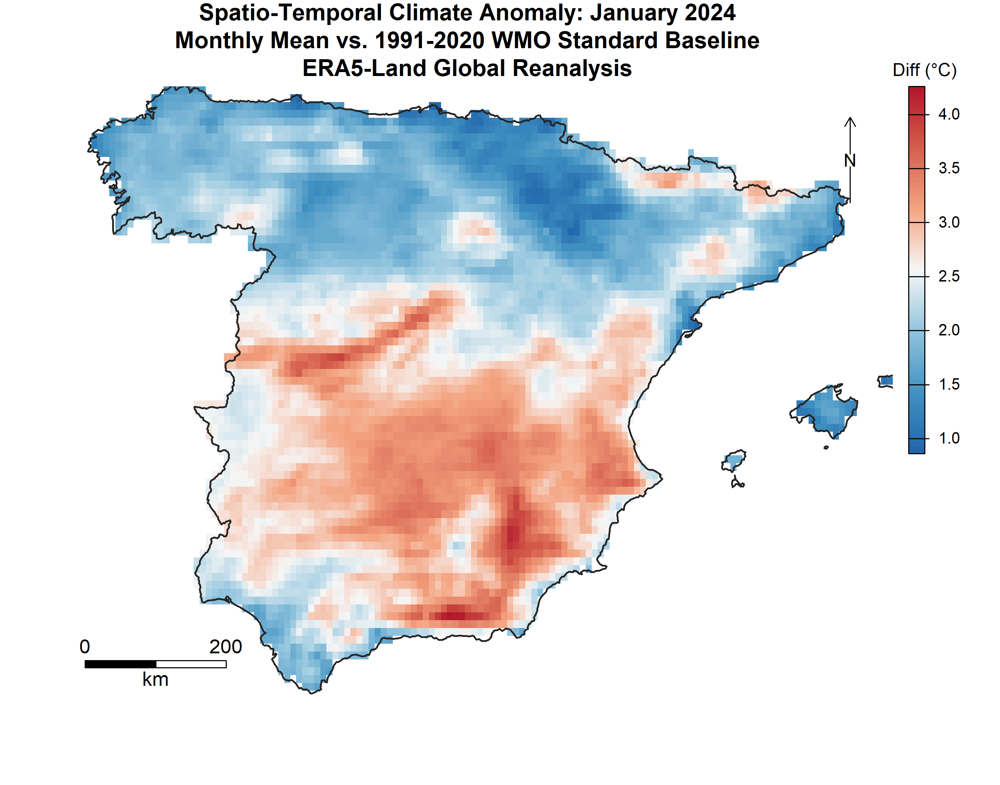

This repository contains an R script that calculates and visualizes temperature anomalies in Spain for January 2024. It compares recent data against the 1991-2020 historical baseline using ERA5-Land monthly averaged data.

The code connects directly to the Copernicus Climate Data Store (CDS) API using the ecmwfr package. It downloads the NetCDF files, automatically handles zip extraction if needed, calculates the baseline and anomaly using the terra package, and then masks the data to the Spanish borders using geodata. Finally, it exports a map in PNG format.

To run this code, you need to install the ecmwfr, terra, and geodata packages in R. You will also need your own Copernicus API credentials. You can get these by registering on the Copernicus CDS website and accepting the terms of use for the ERA5 dataset. Once you have your email and API key, just replace the variables in the script with your own details and run the code.

Key Findings:
The analysis reveals significant positive thermal anomalies across the entire Iberian Peninsula. The most pronounced warming is concentrated in the Eastern and Southern regions, as well as the Central System (Sistema Central), where anomalies exceed +3.5°C to +4.0°C relative to the 30-year climatology. In contrast, the Northern coast and the Balearic Islands show more moderate—though still significant—warming, ranging between +1.0°C and +2.0°C.
